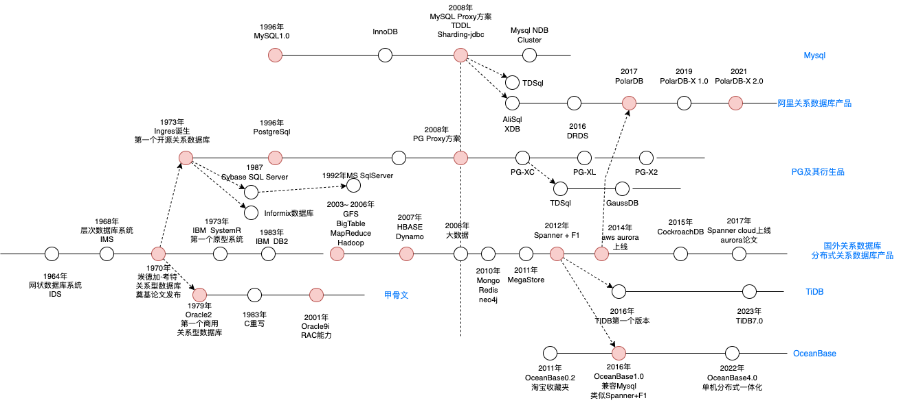

# 关系数据库发展历程
可以通过下图，整体看下关系型数据库发展的历程。

1. 1964年，通用电器的巴赫曼发明了网状数据库系统 IDS（Integrated Data Store），可以灵活的描述事物及其之间的关系，第一个DBMS
2. 1968年，为了支持阿波罗登月计划，IBM设计了层次数据库系统 IMS，最早商业化的DBMS。解决数据独立存储，统一管理和访问的问题
3. 1970年，IBM的埃德加·科德发表《大型共享数据库的数据关系模型》论文，提出关系模型，是关系数据库的理论基础。
4. 1973年，IBM的SystemR项目发布了多篇关于关系型数据研究的文章。Michael Stonebraker（迈克尔 斯通布雷克）受其他开发了Ingres关系数据库并开源。为数据库发展做出巨大贡献。
  a. 选用B+树：读多写少; 数据量千万级；性价比高（磁盘）；按行组织。
5. 1979年，Oracle推出了其关系数据库Oracle2，是第一个商业化的关系型数据库（RDBMS）。
6. 斯通布雷克后来回到伯克利大学后，开启了致力于解决关系模型的数据库管理现有实现的局限性的计划叫Postgres，后与1996年更名为PostgresSQL
7. 另一方面，IBM也在1983年发布了其商业RDBMS（DB2），并持续优化，因为大家接触不多，按下不表，不过IBM在RDBMS上的贡献还是很大的。
8. 在1996年，Mysql1.0问世，其开源特性也为中小机构使用RDBMS提供了可能。
9. 在90年代，随着web1.0的兴起，需要存储的数据增多，单机RDBMS已经不太能够支持数据存储，因此Oracle持续开发分布式的方案，在2001年发布了其Oracle9i，带有RAC（Real Application Cluster）能力，也就是后续的术语叫shared-disk，但其扩展能力有限，而且还贵。
10. 在1996年，随着LSM-Tree论文的发表，为NoSql的发展提供了更优的数据存储思想。
11. 而在2000年以前，关系数据库还处于传统单机数据库时代，已经不能很好的满足社会上的需要。
12. 在2003年到2006年，谷歌发布了其在大数据方面的三篇重量级论文（三驾马车），从此为Nosql的发展指明了方向。大家一看，哎，原来数据库不止可以将单机升配置（竖向扩展），还可以用多个普通机器组成集群（横向扩展），从此开启了Nosql的繁荣时代，而其中BigTable使用LSM-Tree作为存储结构而弃用传统的B+树，也成为如今分布式数据库的主流选择。
13. 2007年，BigTable的开源版HBase发布，使得大家有了从理论到实践可以具象参考的对象。虽然Nosql时代到来，但是其主要解决的是海量数据读写、多种数据结构存储和高扩展性、高可用性的问题。比如存储kv数据，存储网页文档等。仍然没有解决关系型数据库的海量存储和高并发读写的问题。
14. 在2008年以后，为了解决关系型数据库存在的问题，互联网公司采用了妥协方案，即舍弃Mysql的部分功能（比如范围查询，连表查询功能），涉及了分库分表方案。这应该是当时数据库发展滞后的无奈之举。而此时谷歌开始设计Spanner，摒弃分库分表的方案。
15. 在2010年后，因为分库分表带来的扩容、迁移等问题，各大厂开始思考用更合理的方式来设计数据库。也就是大家在思考将关系数据库的事务、一致性等优势和Nosql的海量存储、高扩展性等优势相结合，也就是NewSql数据库。
16. 2011年，谷歌发布MegaStore论文，其中阐述了将NoSQL和关系数据库结合的事情，将关系数据库架设在BigTable之上，但因其较差的写入吞吐（参考MegaStore论文和Spanner论文），谷歌另起炉灶设计了Spanner。
17. 2012年，谷歌发布Spanner和F1论文，又一次让大家看到NewSql的发展方向，于是纷纷相仿，比如国内的TiDB，OceanBase（怀疑是：因为在Spanner发之前，OB是KV系统）。国外的CockroachDB,YugabyteDB（开始是文档数据库）等都是参考Spanner建设的。）。08年就开始设计建设Spanner。鉴于其2004年提供的GMail服务，可能那时候或之后不久MegaStore就在提供服务了。
18. 2014年，AWS基于其在云计算方面的积累涉及的Aurora，是将存储和计算分离，实现存储层的共享，可弹性扩缩容。而受Aurora论文启发，阿里随后也发布了PolarDB，并做了改进。
19. 2016年，TiDB发布第一个版本，同年OceanBase也推出了其兼容Mysql第一个版本OceanBase1.0
20. 在分库分表方向，阿里越做越厚，从TDDL，到DRDS然后再到PolarDB-X，逐渐将分库分表中间件也做成了分布式数据库的样子。
21. 2022年，OceanBase4.0发布，其单机分布式一体化的设计，可能会引导分布式数据库数据库的发展，使其既可以支持大客户使用，也支持中小客户使用。不过随着DB Serverless化，一切尽在未知。
22. 而其他厂商，比如华为，腾讯，则是在Mysql和Pg上进行分布式改造，将其包装成分布式数据库的样子，路子有点像PolarDB-X。
23. 还有SphereEX，基于ShardingSphere（原Sharding-jdbc）建立的公司，见到的第一个分库分表方案商业化公司。其产品当前咖位类似阿里的DRDS。

## 网状数据库

## 层状数据库

## 关系数据库

## 数据库领域四位图灵奖得主
扩展知识，大家可以了解下，不详细介绍了

## MegaStore写吞吐低的原因

可以看出来各结构设计间的优化也是层次递进的，先从一个整体拆分为多个小整体，然后将小整体拆分为有关联关系的独立个体（数据记录）。但是受限于当时的硬件条件，遭到很多批评，但随着机器性能的提升，硬件限制问题迎刃而解，关系模型受到了学术界和工业界的青睐。

# 传统的关系型数据库

**传统关系型数据库**：oracle、Mysql、SqlServer、PostGreSQL。这些主流的数据库都诞生在四五十年前，主要结构化数据的存储和管理的问题，**具有对事务的支持、数据完整性的保证、数据一致性和关系查询的强大能力**。在相当长的时间里，其很好的支撑了业务的使用。在关系数据库的起步阶段，只有金融机构，军事组织和学术研究机构可使用关系数据库，而且被Oracle和IBM熔断，相当小众。但进入90年代，随着社会的发展，互联网在社会上的普及，越来越多的组织开始使用关系数据库，但因为太贵或性能不能满足，转而**使用Mysql和PostgreSql**，这也**促进了关系数据库的发展**。

以Mysql为例

其主要是SQL解析执行的Server层和用来管理数据的存储引擎。

但随着web2.0的兴起，用户需求的提升，传统的集中式数据库在应对海量数据及复杂分析处理时，存在数据库的**横向扩展能力受限、数据存储和计算能力受限**、不能满足业务瞬时高峰的性能等根本性的架构问题。而探索的一个方向就是分布式数据库，其中代表性时间是谷歌在2003年到2006年发布的GFS，BigTable和MapReduce三篇论文。奠定了分布式数据库的基础。从此正式开启了NoSql的时代。

# Nosql数据库

Nosql数据库的分类：

数据库类型	数据库产品	用途	存储方式	优点	缺点
键值数据库	redis，DynamoDB	内容缓存	KV存储	扩展性好，灵活性好，性能高	数据无结构
列族数据库	HBase，BigTable，TSDB	分布式数据存储和管理
IOT、监控	列族存储，将同一列数据存储在一起	可扩展性强，查找速度快，复杂性低	 不支持事务的强一致
文档数据库	mongoDB，couchDB	web应用，面向文档或半结构化的数据	json结构的文档	数据结构灵活，可以根据value构建索引	缺乏统一的查询语法
图数据库	Neo4j、InfoGrid	社交网络，推荐系统。构建关系图谱	图结构	支持复杂的图形算法	复杂性高，支持数据规模有限

**解决系统的海量数据的水平扩展能力和高并发读写能力的限制**，利用分布式集群优势，具有水平扩展能力，可以轻松应对大规模数据量和高并发访问，数据一般非表格化存储，适合半结构化和非结构化的数据，并且都遵循BASE模型，保障数据的最终一致性。而一般不保证数据的强一致性。

## 关系型数据库和非关系型的对比
	关系数据库（传统Sql数据库）	Nosql
优点	1. 用SQL做复杂查询
2. 事务支持	1. 简单查询速度快
2. 横向扩展性好
3. 支持海量数据读写
4. 支持多种格式，可无固定的Schema
缺点	1. 不擅长大量数据写入
2. 不擅长更新时的索引和表schema的变更
3. 不擅长简单查询快速返回	1. 不支持事务
2. 不支持联表处理
适用场景	1. 需要数据的复杂处理，比如联表查、多表事务
2. 数据量不太大，千万级
3. 安全性要求高
4. 数据格式单一	1. 海量数据处理
2. 多格式处理
3. 简单，性能要求高的查询

主要缺陷是缺乏对事务的支持，缺少对SQL的支持等问题导致其不适合处理复杂性高的业务逻辑和数据一致性要求高的场景。Nosql可以认为是解决大规模数据读写访问的一种演进，但其仍然无法解决海量数据场景下复杂业务场景的扩展性问题、计算存储容量不足的问题。

# 分布式关系型数据库
Nosql解决的是海量数据的水平扩展能力和高并发读写能力，但不能很好的支持负责业务场景的海量数据存储问题。一般为了解决复杂业务场景数据（比如交易场景）的海量存储问题，会舍弃传统关系数据库的一些特性（比如范围查询，复杂事务），会采用分库分表的方式来解决。用其他方式（数据仓库）弥补舍弃的能力。
一般的分库分表演进如下，起初是单机数据库，为了高可用会为其增加备库。而为了横向扩展又将数据分库分表存储在多个数据库中，抽象一层建立逻辑上的库表概念。

**分库分表的架构设计，提供中间件来进行分库分表的路由计算**。一般分为客户端方式如 TDDL，和Proxy方式DRDS。不管哪种方式，都是把数据库使用的复杂性丢给了用户，使得用户体验较差。

以tddl架构图为例：

缺陷：
● 扩容不方便。在数据库做分库分表迁移时会带来大量的成本和风险。数据量越大，风险和成本越高。
● 无法支持复杂查询，跨库JOIN。只能在单个库里进行复杂查询
● 分布式事务性能差，甚至不支持分布式事务
● SQL功能确实，导致应用改造成本大。比如原来单库时范围查询一个sql搞定，而分库分表方式基本不支持
● 全局一致性时间点恢复几乎不可实现，不同节点处于不同状态，分开管理。没有统一的快照管理和恢复机制。

随着Nosql在分布式数据存储等方面的成熟，为其添加事务、SQL和增强一致性，解决大规模在线事务型数据的问题又一次提上了日程。**将Nosql沉淀的分布式存储的能力和传统关系型数据库在事务和强一致性上的能力相结合**，提供新型的分布式关系数据库。这一类数据库被称为NewSQL。

而谷歌发布Spanner+F1论文后，也意味着NewSQL时代的到来。

分布式关系型数据库主要的发展方向有三个
1. 基于分片中间件方式。 如TDDL或DRDS，后续衍生的PolarDB-X声明其为shared-nothing架构
2. shared-storage架构。 如PolarDB，AWS Aurora
3. shared-nothing架构。如Spanner，TiDB，OceanBase

下面着重讲下shared-storage架构和shared-nothing架构

          
● shared-storage : 存储计算分离，在存储层做了统一和共享，但计算节点是独立节点。
● shared-nothing：每个节点有独立的计算和存储功能并且节点之间不共享数据，横向扩展时计算资源和存储资源都需要扩展
个人理解：SQL（计算）移向数据 是 shared-nothing，数据移向SQL（计算）是shared-storage 

下面以几类代表数据库（PolarDB、PolarDB-X、TiDB、OceanBase）来看下各自的架构：

## PolarDB架构图

采用`shared-storage`架构，主打的就是要共享存储

1. 借鉴AWS的Aurora系统，利用其云计算的优势，将存储层共享，实现其弹性扩缩容
2. 适用于读多写少的场景，比如一个Mysql拖多个从库提供读比较吃力，可以使用PolarDB替代。一般最多提供15个读节点

缺点：
1. 需要依赖RDMA，如果网络成为瓶颈，则整个集群都受影响。
2. 其只能单点写多点读，扩展了读能力，但写能力受制于主节点的性能，也就是写是不可横向扩展的

## PolarDB-X架构图

`shared-nothing`架构，但看其演进方向，是逐渐将分库分表规则做到数据库层面，越做越厚的过程。而且其最新的演进方向是利用PolarDB的共享存储能力，在`shared-nothing`架构中，又融合了`shared-storage`架构的能力。

1. CN是计算节点（计算引擎），负责SQL的解析和执行
2. DN是存储节点（存储引擎），负责数据的分布式事务和高可用存储
3. GMS是元数据服务
  a. 提供分布式事务使用的全局时间戳
  b. 负责集群的负载均衡，数据调度
  c. 提供统一的元数据，如表Schema
  d. 对CN和DN节点管理，主从切换、上下线等。
4. CDC是binlog服务，可以提供和单机Mysql一样的binlog供DTS订阅

使用DRDS作为其计算引擎，使用Mysql数据库实例作为其存储引擎，当前肯定是做了改造的。内部使用RPC方式通信，计算节点直接给存储引擎执行计划，避免Mysql对SQL的重复解析和优化。
计算节点和存储引擎均在同一物理网络中，不经过SLB或LVS中转，网络延迟低。

### 分布式SQL执行

通过引入中心授时服务（TSO），结合多版本并发控制（MVCC），确保读取到一致的快照，而不会读到事务的中间状态。如下图所示，提交事务时，计算节点（CN）执行事务时从TSO获取到时间戳，随着数据一同提交到存储节点（DN）多版本存储引擎上，CN通过读取快照时间戳去DN上读取相应版本的数据。

### PolarDB-X未来演进

PolarDB-X结合PolarDB云原生的技术，可以基于PolarDB的共享存储+RDMA网络优化能力，提供秒级备份、极速弹性、以及存储按需扩展的能力。基于共享存储的基础上，结合分布式的多点写入能力，可以在不迁移数据的前提下提供秒级弹性的能力，给到用户完全不一样的弹性体验。

## TiDB架构图
采用shared-nothing架构，计算和存储分层设计

● PD整个集群的大脑，类似于Spanner中的PD（placement Driver）,也是负责集群资源的调度，分布式事务时间戳的获取等。
● TiDB是计算引擎，类似于Spanner上层的F1，PolarDB-X中的DRDS。是分布式计算的部分，负责SQL的解析（翻译为KV操作），路由，分发及分布式事务等。因其节点无状态，可按需扩容
● TiKV是内嵌RocketDB作为存储引擎，行存储，主要用来执行有事务的读写操作。支持OLTP操作
● TiFlash是OLAP的存储引擎，列存储，主要用来做分析使用，主要支持的分析SQL是SparkSQL。
利用Raft实现高可用

### 存储层架构图

● 存储数据按照Region为分隔单位，按Key的Range分隔，连续的Key会存储在相同的Region节点上，默认为96M。可以自动分裂Region，实现自动分片分裂。但同样因分裂后的Region不一定在同一节点上，也会造成跨机分布式事务增多。比如，同时in查询三个跨度比较大的uid，可能会产生分布式事务。
● 因为其做OLTP和OLAP是两份数据，内部做了数据同步。在提升OLAP性能的同时，也提升了存储成本和架构复杂度。
● 但其这种存算分离的架构，对要求超低延时的OLTP操作不太友好。因其在TiDB解析后，再分发到TiKV执行（网络），查询结果后返回，中间多了一层网络，使得其要求有更快的存储介质和低延时的网络架构。

### SQL层架构

用户的 SQL 请求会直接或者通过 Load Balancer 发送到 TiDB Server，TiDB Server 会解析 MySQL Protocol Packet，获取请求内容，对 SQL 进行语法解析和语义分析，制定和优化查询计划，执行查询计划并获取和处理数据。数据全部存储在 TiKV 集群中，所以在这个过程中 TiDB Server 需要和 TiKV 交互，获取数据。最后 TiDB Server 需要将查询结果返回给用户。

## OceanBase架构图

`shared-nothing`架构
1. OBproxy是其代理层，应用的连接都连在OBProxy上，其负责将请求转发到指定的OBServer上，会进行路由信息的解析。
2. OBServer是一个OB节点，其拥有完整的SQL计算、存储引擎和数据存储能力。一个OBServer可以简化认为是一个Mysql实例。
3. 每份数据都是多副本的，然后一个ZONE有完整的副本，而一个ZONE包含多个OBServer，数据均匀的分布在OBServer上
4. 基于Paxos实现多副本的一致性
5. GTS全称，全局时间戳服务。与Spanner中的TrueTime作用类似，都是为了提供确定的时间戳（或叫事务版本号），保证全局的事务有序。
6. RootService为OB集群的大脑，负责集群资源的调度、收集OBServer心跳，负载均衡，OBServer主从切换、上下线等。通过Paxos协议保证其高可用性。

# 存储结构：LSM-tree

简单列举下使用LSM-Tree作为其存储数据结构的产品：TiDB，XDB，OceanBase，Lindorm、BigTable，Hbase、LevelDB、RocketDB、Tair-LDB、ES（elasticsearch）、OpenTSDB、Prometheus等。
因为现在新架构的底层存储结构基本都是用的LSM-Tree，保留PolarDB底层的XDB引擎也是基于LSM-Tree思想，因此在这里简单介绍下LSM-Tree。
LSM-Tree全称是Log Structured Merge Tree，是一种分层、有序，面向磁盘设计的数据结构，其核心思想是利用磁盘批量的顺序写要比随机写性能高的特点，将所有更新操作都转化为追加写方式，提升写入吞吐。

LevelDB是实现的LSM-Tree思想的比较纯粹的存储库，借用其架构图解释下LSM-Tree的大概机制。

1. 数据分层，MemTable和SSTable，数据更新在MemTable，读取时将MemTable和SSTable数据合并。
2. 先写WAL，再写MemTable。利用磁盘顺序写的性能，使其写性能比随机写的机制提高百倍。
3. 定期进行Compaction，进行数据版本的压缩
缺点：
1. 有写放大的问题，设计不好，数据越多写放大越严重
2. 在大量进行Compaction时，会比较影响机器提供服务的性能。

## LSM-Tree和B+Tree对比

因为有专门研究过OB，下面继续以介绍OB的方式，稍微深入了解下分布式数据库。

# OB的主要技术架构

## 架构图

## OB SQL执行流程
                
图中的Optimizer（优化器）是SQL优化的核心，是根据规则优化和代价优化计算后，根据需要将串行计划改造为并行计划。然后并行的去请求各自的数据。
三种执行作业
1. 本地作业：如果访问的数据在本机，则直接执行，类似单机数据库的SQL执行，无分布式事务。
2. 远程作业：查询数据只在其他一个服务器上(一般切主造成的缓存未更新)，直接将请求达到对应机器执行事务并返回数据，避免事务的RPC，无分布式事务
3. 分布式作业： 查询数据在多台服务器上，比如范围查询。需要并行查询，然后将结果缓存在各自机器上。由调度器拉取查询结果，因此分布式的作业需要在调度器上开启分布式事务。

## OB分布式事务提交流程

两段式协议包含协调者（Coordinator）和参与者（Participant）两个角色
● 协调者负责整个协议的推进，使得多数参与者达成一致的决议。
● 参与者相应协调者的请求，完成prepare和commit/abort操作

### OceanBase支持的隔离级别

默认隔离级别是读已提交

## OB存储架构

介绍下OB的存储架构。基于LSM-Tree思想

1. 静态基线数据存储在SSTable中，在磁盘上
2. 动态增量数据存储在MEMTable中，在内存里
3. LSM-Tree的结构决定了其写性能是很好的，本身该结构就是针对写做的优化。顺序写代替随机写。
4. 另外OB在内存中构建了各种缓存来解决读性能的问题。
  a. ROW Cache解决点查的请求，比如根据id查一条记录
  b. Block Cache是解决大的查询，比如范围查询
  c. 布隆过滤器，避免不存在的数据穿透到时间最早的SSTable上影响整体性能
通过使用LSM-Tree和对读进行大量缓存，可以同时提高写的性能和读的性能。
另外OB在使用时推荐大内存，大内存一方面是用于MEMTable做增量数据使用，另一方面也是为了做Cache使用。
转储后的SSTable总共有 4 层。DML 操作插入、更新、删除等首先写入 MemTable，等到 MemTable 达到一定大小时转储到磁盘成为 L0 SSTable。L0 SSTable 个数达到阈值后会将多个 L0 SSTable 合并成一个 L1 SSTable。在每天配置的业务低峰期，系统会将所有的 MemTable、L0 SSTable 和 L1 SSTable 合并成一个 Major SSTable。

## OB高可用架构

1. 代理高可用。
  a. 定时任务刷新状态；
  b. Server保活机制，探测OBProxy与OBServer连接状况；
  c. Client探活机制，探测OBProxy和Client之间的连接状况；
2. 分布式选举。
  a. 利用Paxos协议，Leader宕机后，自动选举副本为Leader
  b. 利用租期（Lease）机制确保同一时间只有一个节点认为自己为Leader，避免脑裂问题；
3. GTS高可用。GTS为全局时间戳服务。提供事务版本号和选举租期；并通过Paxos保证自身的高可用。
4. OBServer节点故障自动处理
  a. RootService会收集OBServer的心跳状态，根据其状态判断OBServer当前使用可用。不可用的话则将其摘掉，并将其上存储的数据在其他OBServer上重建。

### 容灾部署方案

国内数据库排行

