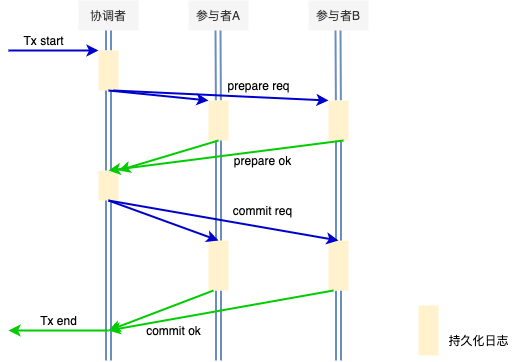
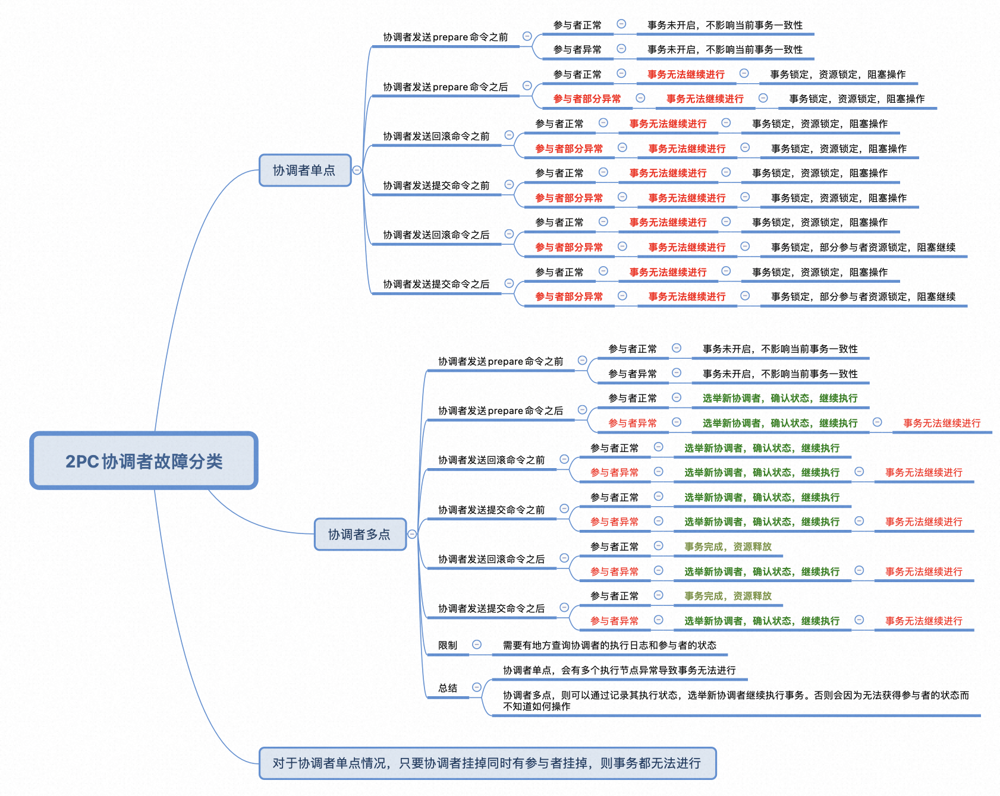
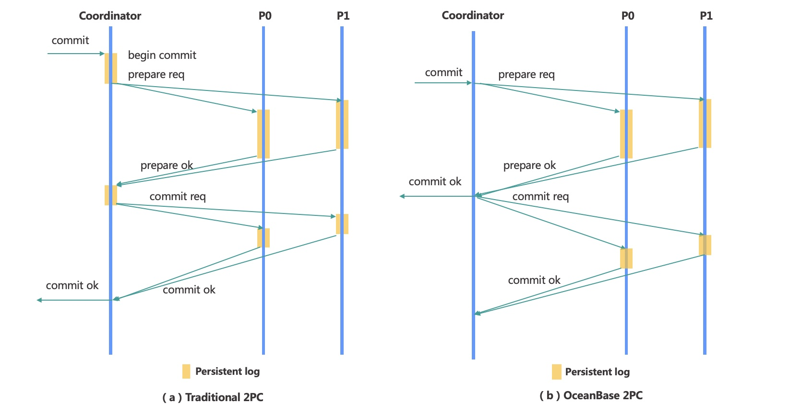
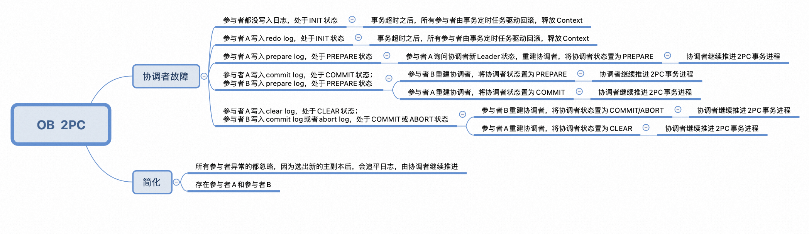
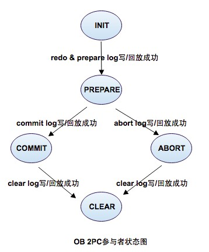

OceanBase使用两阶段提交(2PC)来解决分布式事务的问题。

# 标准两阶段提交的示意图

2PC的执行流程

1. 协调者写prepare log，日志持久化成功后，向所有参与者（A和B）发送prepare request的消息。
2. 所有参与者A和B决定是否可以提交，可以提交则写入prepare log，不可以提交则写入prepare no log。
3. 所有参与者A和B响应协调者请求，发送prepare ack信息（ok 或者 no）
4. 协调者收集所有协调者的ack结果，并记录log（commit/abort）。都是ok则发送commit指令，有一个no则发送abort指令给所有参与者。
5. 每个参与者收到消息后，开始执行commit或abort操作，日志持久化完成后，解锁并释放资源。
6. 参与者响应协调者的请求回复ok消息。参与者释放资源并退出。
7. 协调者收齐所有参与者的commit响应消息后，响应调用方并释放资源后退出。

正常情况下，以上的流程都是可以很好的解决分布式事务问题的。但如果是异常情况出现呢，以下列出不同异常情况下的影响

# 协调者故障时异常情况的分类

如上图，协调者故障时，一旦有参与者异常退出，事务都无法进行，因为无法获取到参与者的状态。既然分析出协调者和参与者的异常情况，则可以针对性的解决，即可以使用多个协调者和多个参与者，一旦一个节点异常失效后，自动选举新的节点继续执行事务。

# OB是如何解决上面的事务无法继续的问题的

1. 对于协调者，在OB中一般是使用一个主副本作为协调者的，而如果主副本挂掉后，OB的副本选举机制会选举出新的主副本来作为协调者推进事务，也就是协调者是多点的。
2. 那对于参与者异常的情况，OB同样是使用选举机制，选出新的参与者主副本执行协调者分配的事务。

# OB的分布式事务机制

OB两阶段提交步骤

1. 协调者向所有参与者发送prepare请求，
2. 参与者开启日志状态机，根据情况判断是否OK，并写入事务版本号和所有参与者列表，写redo log和prepare log，回应prepare ok或者prepare no ok。此时事务除commit外的操作都做了。
3. 协调者在接收到所有的参与者的prepare结果后，如果都是prepare ok，则直接给用户返回 commit ok, 否则给用户返回no ok。并给所有参与者发送commit请求或abort请求。
4. 所有参与者在处理完commit或abort后，返回commit ok或者abort ok结果，释放资源。
5. 协调者发起 clear 请求，推进日志状态机，清理事务context
6. 参与者执行将状态机推进到clear状态
7. 协调者收到所有的clear ok结果，清理状态机，结束事务。

# OB优化后的优势

1. 标准两阶段提交： 4次日志延迟（协调者和参与者持久化日志）+ 2次RPC延迟
2. OB 两阶段提交：  1次日志延迟（参与者持久化prepare日志）+ 2次RPC延迟

OB对2PC的优化是在所有的参与者在第一阶段都返回OK后，直接向用户返回事务执行成功。

# 在协调者宕机故障恢复后，OB如何处理未完成的事务

首先，因为不管协调者还是参与者，都是各分区的主副本，通过Paxos协议持久化相关日志，因此即使有节点挂掉，也会通过选举方式选出新的主副本来参与分布式事务。那接下来分别看下不同阶段协调者宕机和参与者宕机后，OB的处理机制。

以下为OB分布式事务协调者在不同阶段故障恢复后的后续执行状态，可以看出协调者的状态会被参与者重建，并继续推进2PC的事务进度

# 那OB的新协调者采用什么机制保证继续推进事务进度的呢

- 首先，OB的协调者是无状态的，因此不需要在本地写事务日志。即使协调者宕机后，新选出的协调者Leader会继续推进事务，而其推进事务采信的是参与者在参与重建时为其赋予的参与者当前的状态。
- 其次，OB增加了CLEAR阶段来完成状态机的推进，如果没有CLEAR阶段，那如果参与者A处于COMMIT状态，写入日志并释放，而参与者B处于PREPARE状态时。
   
   - 对于新的协调者看来，参与者A没有context，会返回prepare unknown，参与者B处于PREPARE，因为协调者不知道参与者A有没有写prepare log，只能补prepare no log，会执行回滚操作。与实际不符合。
   
   - 增加了CLEAR可以明确知道参与者A完成了COMMIT操作，等待退出状态机，保证参与者A的COMMIT状态不丢失。这样协调者就可以采用参与者B重建状态，并推进参与者B执行COMMMIT操作，然后一起执行CLEAR操作。
   
   - 本质上是因为协调者不写日志，是无状态的。

OB采用状态机来保证分布式事务在参与者节点上的顺利执行。基于状态机进行状态流转，将状态机置为对应状态，然后按流程执行一遍即可，对正确性没有影响。

# OB的两阶段提交中，为什么协调者不写日志，协调者不写日志的好处是什么

与传统两阶段提交协调者写日志相比，协调者不写日志是有利于加快事务响应客户端的速度，同时降低事务在执行过程中两阶段锁的持锁时间，具体地，传统两阶段提交在响应客户端之前需要等待时间为：Tx = Ta（协调者同步写BEGIN日志的时间）+ Tb（所有参与者并行写prepare日志的时间）+ Tc（协调者同步写COMMIT日志的时间）；OB的两阶段提交在响应客户端之前需要等待的时间为：Ty = Tb（所有参与者并行写prepare日志的时间）。两相比较，**Ty比Tx减少了协调者两次持久化日志的时间**。OB两阶段提交是对传统两阶段提交协议的一个优化，该优化**有利于提高客户端的响应速度，降低两阶段锁的持锁时间**，对提高数据库的整体吞吐量可能带来一定帮助。

# OB的2PC为什么多了个clear阶段

OB多出一个clear阶段的原因如下
1. 假设OB的两阶段提交中没有clear阶段，考虑如下场景，存在一个两阶段提交事务，该事务的参与者涉及A和B，协调者收到A和B的prepare ok请求后决定提交该事务，并分别给参与者A和B发送commit请求，参与者A收到commit请求后，持久化commit日志后退出（注意，OB的参与者两阶段提交状态是在clear日志持久化后退出的，这里我们假设OB没有clear阶段，则参与者的两阶段提交状态在commit日志持久化后退出），参与者B没有收到commit请求，参与者B仍然处在prepare状态。此时如果协调者发生故障，由于参与者A的两阶段提交状态已经退出，参与者B无法查询到参与者A的状态，导致两阶段事务无法继续推进。因此OB的两阶段提交中增加了clear阶段，参与者持久化commit日志后其提交状态并没有退出，而是直到参与持久化clear后才退出，因此在两阶段提交中引入了clear阶段。

2. 在OB的两阶段提交模型中，对于一个事务，只要所有的参与者都prepare ok并持久化了prepare日志，那么此后即使协调者发生故障，该事务最终也一定会提交，OB的两阶段提交中，消息交互通过异步rpc实现，消息的接收方不会判断消息的发送方是否正常，消息接收方对所有传入消息无差别处理。在OB这样的消息处理机制下考虑如下的两阶段提交场景，存在一个两阶段提交事务，该事务的参与涉及A和B，A和B分别成功持久化prepare日志，并等待commit请求，协调者正常推进两阶段提交向A发送commit请求消息后故障，由于网络延迟，协调者发送给A的commit请求飘在网络上迟迟没有送达到参与者A，状态机故障恢复后产生新的协调者继续推进两阶段提交，如果此时在OB的消息处理机制下，新的协调者选择回滚事务并给参与者A和B发送abort请求，该事务最终不能满足原子性。因为在OB的消息处理机制中，参与者不会检查消息发送方是否仍然有效，这就导致网络上存在着3个有效的消息包：
 - 其1为旧的协调者发给参与者A的commit请求
 - 其2为新的协调者发送给参与者A的abort请求
 - 其3为新的协调者发送给参与者B的abort请求；
 
 如果消息1和消息3分别在参与者A和参与者B上执行生效，就会导致该事务最终违反原子性。因此在OB的两阶段提交协议中强制规定，只要全部参与者都处于prepare ok状态，即使此后协调者发生故障，新的协调者也会强制提交该事务。

